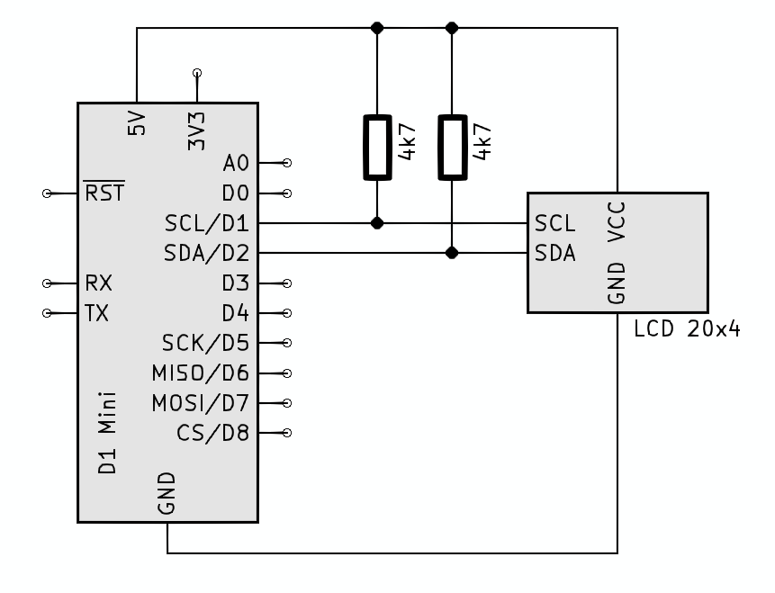
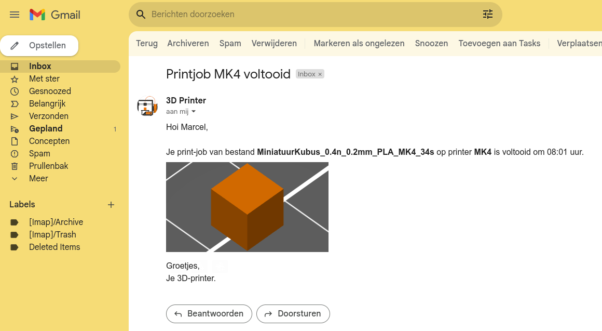
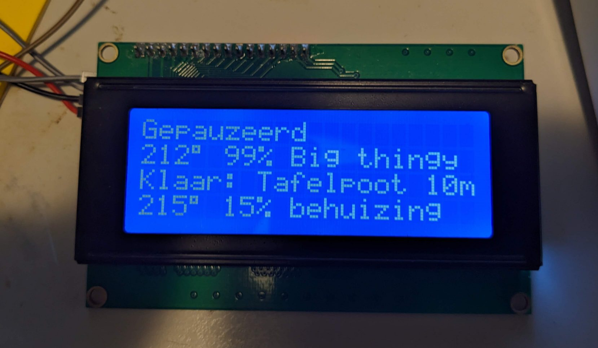

# BigLCD-3DPrintMonitor
Een 3D-Printer monitor met groot LCD die push-berichten verstuurd. Dit is een alles-in-1-oplossing voor een 3D-Printmonitor- en 3D-Printnotificatiesysteem. Op een LCD van 20x4 laat hij de status, temperatuur, naam van het geprintte object zien van 4 stuks 3D-printers tegelijk.

Als een print klaar is verstuurt hij een e-mail.

Hardware: zie schema. De I2C-bus heb ik met pullup-weerstanden met de 5V verbonden (terwijl de ESP8266 met 3,3V werkt) want ik heb gemerkt dat hij daardoor stabieler is.

Hieronder een testopstelling. Elke regel van het LCD laat de status van een enkele printer zien. De eerste printer staat stil, de tweede en de vierde zijn aan het printen (achtereenvolgens een object met de naam 'Big thingy' en 'behuizing') en de derde printer is klaar met het printen van 'Tafelpoot 10m'. Die derde printer heeft een mail verstuurd dat hij klaar was.

